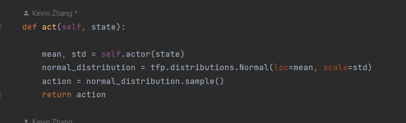

# Deep-Jump
### Part of the code from https://github.com/wptoux/deep-tiaotiao
## 1. Introduction
- In recent years, reinforcement learning algorithms have gained significant attention due to their ability to learn complex tasks through trial and error. One area of particular interest is game playing, where these algorithms can learn to play games at a superhuman level. In this project, we aim to develop an intelligent agent capable of playing a specific game using Proximal Policy Optimization (PPO), a state-of-the-art reinforcement learning algorithm, combined with Convolutional Neural Networks (CNNs) for visual feature extraction.

## 2. Background
- The Actor-Critic algorithm is a popular approach in reinforcement learning that combines the benefits of both value-based and policy-based methods. It consists of two components: an actor that learns a policy (mapping states to actions) and a critic that evaluates the value of state-action pairs. PPO, an advanced variant of the Actor-Critic algorithm, introduces a clipped objective function and importance sampling, which enables more stable and efficient learning.

## 3. Model Architecture
- Our model architecture combines a CNN with PPO to handle visual input from the game environment. The CNN is responsible for extracting meaningful features from the game's screenshots, while the PPO algorithm optimizes the policy using these features. The Actor and Critic networks both use a series of convolutional and dense layers to process the input data, and their specific configurations are detailed in the implementation section.

## 4. Data Collection
- Since we do not have access to the internal gaming environment, we take screenshot before and after the action taken as state and next_state, and then feed them into a CNN. Thus data collection for this project involved capturing screenshots and replay data from the game environment. The screenshots were used as input for the CNN, and the replay data provided information on the actions taken and their outcomes. The data was preprocessed to ensure compatibility with the CNN architecture and to normalize the input values.

## 5. Implementation and experiment
- The implementation of our PPO agent consisted of several key components, including a training loop, a replay buffer for experience storage and sampling, and learning rate scheduling to adapt the learning rate during training. We experimented with various hyperparameters, such as the number of epochs, batch size, and learning rate, to optimize the performance of our model.
- Due to lack of experience in implementing RL algorithm, we were looking at several implementations of a DDPG algorithm and an customized environment for this game from a similar project. The DDPG algorithm converges within about 700 episodes, and it is able to play more than 50 step in a row. We decided to make DDPG a baseline model for our experiment and explored whether more improvements, such as faster convergence, can be achieved with our PPO algorithm. 
- The action space for this game has the size of 1. Thus, the actor network will produce a mean and standard deviation, and our PPO agent will sample from the distribution defined by those two parameters. 
- After an action is taken, the post_action state, reward, and the status of the game will be recorded by memory. When the step reaches certain number, all the (state, next_state, reward, status of game) tuple will be sampled and replayed with respective batch size. The actor and critic network will be updated at this point. (image here)
- Based on the current DDPG agent, we plan to improve the reward feedback for our PPO agent by giving the agent more reward once it lands at the center of the following target, while the current reward is incremented by one with every one more successful jump. Our experiment for the implementation with opencv includes: 1. Determine the center of the current block and measure the distance of that to the agent; 2. Directly use the points at the left top corner of the screen as our reward. (image here). The first approach is quite hard to implement due to the complexity of the environment, while by the second the approach we can always identify the reward from gaming environment. However, we soon realized that PPO agent might not converge as fast as DDPG, so we go with the "1 reward per step" reward feedback and try to solve convergence problem at the first place. 
- There were several parameter's available for tuning: learning rate, batch size for replay, the clip ratio for policy update, and the threshold at which we call replay and update. After several trials on each of them, including learning rate: 1e-3, 1e-4, 1e-5; batch size: 64, 32; clip ratio: 0.2, 0.3, 0.4; threshold: 256, 512, and after 1000 episode of training(about 1000 steps) on each condition, there's no significant increase for total reward, that the total reward is always close to half of the total training steps. 

## 6. Results
- Despite extensive experimentation, the model has not yet converged to a satisfactory performance level. The actor loss and critic loss values, as well as in-game performance metrics, indicate that further improvements are needed. Possible reasons for this lack of convergence may include suboptimal hyperparameter choices, limitations in the data collection process, or issues with the model architecture.

## 7. Conclusion
- In this project, we aimed to develop an intelligent game-playing agent using a combination of CNNs and PPO. Although our current implementation has not achieved the desired level of performance, we believe that with further investigation and improvements, the model has the potential to learn and excel in the game environment. Future work may involve fine-tuning the hyperparameters, exploring alternative architectures, or augmenting the data collection process to enhance the learning capabilities of our agent.

